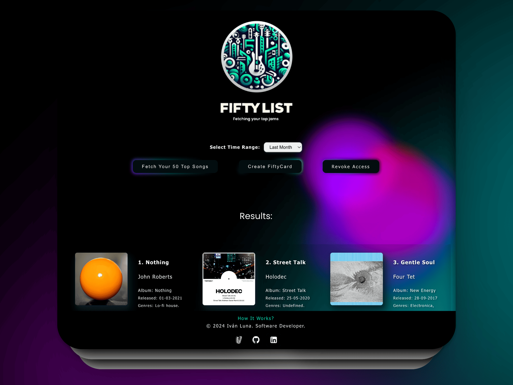

## Welcome to the [Fifty List](https://fiftylist.vercel.app/) Project.

This project is a music automation platform and is featured within my portfolio at ivanluna.dev. It showcases a seamless integration of React and Python. For detailed insights, please visit [this link](https://ivanluna.dev/projects/post-reactpython-fiftylist/).

### Demo

Visit the live app: [fiftylist.vercel.app](https://fiftylist.vercel.app)

### Preview



### Key Features

#### Frontend (React.js)
- Spotify Integration: Fetches your top 50 tracks from Spotify within a chosen timeframe (1, 6 months, or all-time classics).

#### Backend (Python)
- Flask-Powered: Acts as a middleware that interfaces with React.
- Fifty Card: Organizes retrieved tracks dynamically into a static brand new website in order to provide sharing functionality to social media or for accessing later, including artist names, song titles, album names, release dates, and genres.

### About the Project

FiftyList is an exploratory project diving deep into the collaboration of different programming languages and APIs. It is designed to:
- Demonstrate Seamless Communication: Showcases smooth communication between the frontend and backend using API calls.
- Emphasize Language Synergy: Highlights the synergy between React's frontend prowess and Python's backend efficiency.
- Data Presentation Challenge: Ensures that complex data is rendered in a user-friendly format and transmitted effectively between systems.

### Installation and Usage

#### For Frontend Installation:
1. Clone this project.
 ```bash
git clone https://github.com/imprvhub/fiftylist-react-v2.git
```
In your IDE terminal:
1.2 Navigate to the project directory
```bash
cd /your/folder/directory/fiftylist-react-v2
```
3. Run the command `npm install` to install all required dependencies.
4. Replace the environment variables (`REACT_APP_SCOPES`, `REACT_APP_REDIRECT_URI`, `REACT_APP_CLIENT_SECRET`, `REACT_APP_CLIENT_ID`) with your own. You can generate these variables from Spotify Developer Dashboard.
5. Replace the variable defined at the beginning of the code in `App.js`:
   `const redirectUri = 'https://fiftylist.vercel.app/callback';` with -> `const redirectUri = "http://localhost:3000/callback";`
   Update the URLs in the variables of the `exportShare` function from `'https://fiftylistbackend.vercel.app/share'` to `'http://localhost:5000/share'` if your Python backend is using a different 
   port.
6. Run `npm start` from your IDE terminal; this should start the frontend on the designated port. Repeat the process for the backend.

#### For Backend Installation:
#### Prerequisites:
[**Python 3.11**](https://www.python.org/downloads/release/python-3110/)

1. Clone the project. ( https://github.com/imprvhub/fiftylist-python )
 ```bash
git clone https://github.com/imprvhub/fiftylist-python.git
```
In your IDE terminal:
1.2 Navigate to the project directory
```bash
cd /your/folder/directory/fiftylist-python
```
2. Run the command `pip3 install -r requirements.txt` to install all required dependencies.
3. Replace the variable defined at the beginning of the share.py code: `cors = CORS(app, resources={r"/share": {"origins": "https://fiftylist-frontend.vercel.app/"}})` with ->  `cors = CORS(app, resources={r"/share": {"origins": "http://localhost:3000/"}})` (or the port you designated for your frontend).
4. Run `python3 share.py`.
   
IMPORTANT: Open two separate windows in your IDE to run the fullstack locally. Execute the commands to have both projects running simultaneously for them to work seamlessly.

### Feedback & Support
Your input matters, and I'm ready to help address any inquiries or feedback you may have. Your contributions are essential for refining the project and enhancing the overall user experience. Don't hesitate to get in touch with me:

Feel free to share your insights, recommendations, or suggestions for continuous improvement. If you encounter any challenges or require assistance, please [create a new GitHub issue](https://github.com/imprvhub/fiftylist-react-v2/issues/new). Be sure to provide a detailed description of your issue to facilitate prompt and precise support.

## License
For more information regarding this topic please read the following [Terms and Conditions Section.](https://fiftylist.vercel.app/html/termsandconditions.html)
